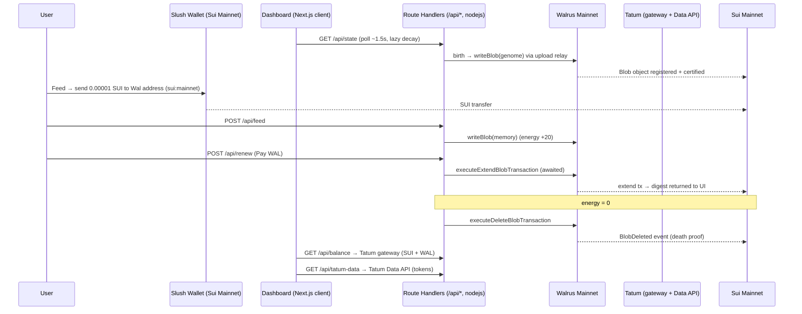
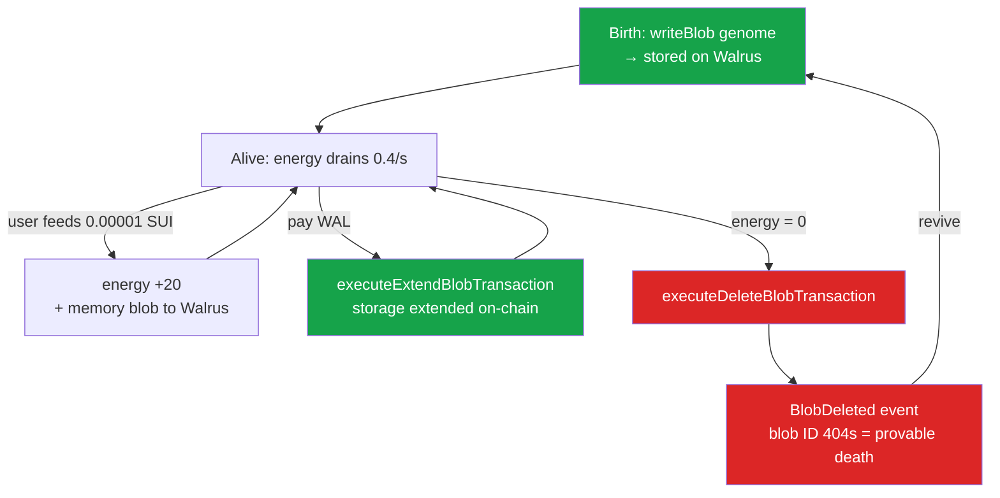

<p align="center">
  
</p>

<h1 align="center">Wal is Alive</h1>

<p align="center">
  An organism that pays to remember — or forgets forever. Its body and memories live as blobs on <strong>Walrus</strong>; keeping them alive costs <strong>WAL</strong> every epoch. To survive, the Wal must <em>earn</em> (users feed it SUI) and spend that income to extend its storage — and when it can no longer pay, it deletes its own body, a death that is <strong>provable on-chain</strong> via a <code>BlobDeleted</code> event. No human bails it out.
</p>

<p align="center">
  <a href="https://wal-is-alive.vercel.app"><strong>🌐 Live Demo</strong></a> · <a href="https://github.com/0xpochita/wal-is-alive"><strong>📦 Repository</strong></a> · Built on <strong>Sui Mainnet</strong> with <strong>Walrus</strong> + <strong>Tatum</strong>
</p>

---

Wal is Alive is a **living dashboard for a self-funding digital organism** built on **Sui Mainnet + Walrus + Tatum**. The Wal's genome and every memory are written as real blobs on **Walrus**; Walrus storage is *rented per epoch and paid in WAL*, so the cost of staying stored is literally the creature's metabolism. Users **feed** it SUI from their wallet to refill energy and write a fresh memory; the Wal **pays WAL** to extend its blob's storage on-chain; and when its energy reaches zero it **deletes its own body blob** — emitting a `BlobDeleted` event that anyone can verify. All on-chain access to Sui flows through **Tatum** (RPC gateway for balances, Data API for token discovery, MCP config for AI tooling).

In plain terms: **Wal is Alive turns AI on-chain news into a public good.** Instead of everyone buying their own AI subscription to read on-chain news, one shared agent publishes AI on-chain news about Sui & Walrus for *everyone* — and the community keeps it alive simply by feeding it. As long as the Wal is fed, the news keeps coming; the moment it goes unfed, it dies and the news stops, provably on-chain.

> **The body literally *is* Walrus blobs; the storage cost *is* the metabolism. Remove Walrus and there is no Wal.**
>
> - **Survive** → feed it SUI → energy refills, a memory is written to Walrus, the Wal lives a little longer.
> - **Persist** → pay WAL → the real Walrus extend transaction lands on Sui Mainnet with a tx hash you can open.
> - **Die** → energy hits zero → the Wal deletes its own body blob → `BlobDeleted` on-chain, the blob ID 404s. Provable, permanent, no bailout.

---

## What Makes Wal is Alive Special

### Who This Is For

Anyone who has watched an NFT's image quietly 404 — the token still on-chain, the media pointing at storage nobody kept paying for — has seen Problem A in the wild. Anyone who has run an AI agent that died the moment the bill stopped has seen Problem B. The unanswered question behind both: **who keeps decentralized data alive, continuously, without a human remembering to top it up every period?**

Wal is Alive is the most tangible possible answer to that question, built for hackathon judges and viewers who need to *immediately* grasp "a creature that pays to live, or dies." It is not an art project with a story bolted on — its survival is a real economic loop on Sui Mainnet, and its death is a real, auditable on-chain event. The pattern it demonstrates is reusable: an NFT that funds its own image storage from royalties, an archive with an "endowment," a verifiable AI-agent memory.

### The Problem

Three real Web3 problems, fused into one demonstration:

- **Problem A — decentralized storage is rented, not eternal.** Many assume that once data lands in Web3 storage it is safe forever. It is not. On Walrus, storage is leased per *epoch* and must keep being paid in WAL. When the lease lapses and is not renewed, the blob becomes unavailable. This is exactly why so many NFTs have "dead images." Nobody has cleanly answered *who keeps the data alive on its own*.
- **Problem B — AI agents cannot fund their own existence.** A long-running agent needs memory, storage, and compute, and so far there is always a human paying the bill. When the human stops, the agent dies silently. There is no clean model where the agent **earns enough itself** to keep its memory alive.
- **Problem C — AI on-chain news is paywalled, one subscription per person.** Reading AI-written news about on-chain activity means everyone buys and pays for their *own* AI subscription — so it stays gated, and not everyone can access it. There is no shared, always-on agent that publishes that news as a public good for the whole community.

> **The Wal's answer:** one shared AI agent that publishes **AI on-chain news about Sui & Walrus for everyone**, funded not by individual subscriptions but by the community that feeds it. As long as it can earn, it stays alive and keeps publishing; the moment it goes bankrupt, its memory is deleted — permanently, provably, without a bailout. Nobody needs their own subscription — feed the one Wal, and the news stays alive for all. The pay-or-perish mechanism is a **reusable pattern** for any Web3 data that needs to outlive its creator.

### The Solution

Wal is Alive solves this with a small set of real primitives on the Walrus + Sui + Tatum stack:

**1. The body literally lives on Walrus.** The genome (a salted JSON blob) and every memory are written to **Walrus Mainnet** via the `@mysten/walrus` SDK + upload relay. Each entry in the dashboard shows its real blob ID, openable on the Walrus aggregator. Salt is embedded in every payload so identical bytes never dedupe into a blob the Wal does not own.

**2. Metabolism = storage cost.** Energy drains continuously (lazy decay computed on every read). The drain represents the shrinking Walrus storage lease — it is what makes the Wal able to *die*.

**3. Earn by feeding (real SUI on Mainnet).** A connected Slush wallet sends a tiny amount of SUI (`0.00001`) to the Wal's address. The server bumps energy `+20` and writes a fresh memory blob to Walrus. A confirm modal previews the spend; a success toast explains what happened.

**4. Pay WAL to persist — real-time.** "Pay WAL to extend storage" awaits the **real on-chain Walrus extend transaction** (`executeExtendBlobTransaction`) and surfaces its tx digest. A confirm modal shows the **actual WAL cost**, quoted live from `walrusClient.storageCost(...)` (~0.0092 WAL for 3 epochs) before anything is signed.

**5. Provable death.** At zero energy the Wal calls `executeDeleteBlobTransaction` on its own deletable body blob — Walrus reclaims the storage and emits **`BlobDeleted`** on Sui. The blob ID that resolved a moment ago now 404s. Death is auditable, not a database flag.

**6. Tatum as the rail to Sui.** Wallet/treasury **balances** are read through the **Tatum Sui RPC gateway** (`x-api-key`); the **Tatum Data API (Token API)** powers an interactive token-discovery tab; and **Tatum MCP** is wired via `.mcp.json` for AI tooling — covering the *Best Use of Tatum Tools* path.

**7. An AI news layer.** Two tabs surface current AI-written news about Sui & Walrus (ecosystem + on-chain), generated through a server-side **OpenRouter** proxy that keeps the key off the client, grounds answers in real web sources, and caches results.

---

## The Survival Loop

| # | Stage | What happens |
|---|-------|--------------|
| 1 | **Body stored on Walrus** | Genome + memories live as blobs; lifetime is measured in *epochs*. The dashboard shows each real blob ID. |
| 2 | **Metabolism burns** | The storage lease shrinks over time → energy falls. This is the Wal's "hunger." |
| 3 | **Must earn to live** | A user feeds it SUI (`0.00001`) from a connected wallet → energy refills `+20` → a new memory blob is written to Walrus. |
| 4 | **Extend storage on Walrus** | The income pays **WAL** to extend the blob's lifetime on-chain (real `executeExtendBlobTransaction`, tx digest shown). The loop repeats. |
| ✕ | **Energy = 0 → death** | The Wal deletes its own deletable body blob. **`BlobDeleted`** is emitted on Sui; the blob ID becomes 404 = verified death. |

> 🔴 **The strongest demo moment.** When the Wal deletes itself, the blob ID that was live a moment ago no longer resolves — then the `BlobDeleted` transaction is right there on the Sui explorer. On **Mainnet**, this is a real production-network deletion.

---

## Features

- **Real birth on Walrus** — on first load the Wal seals its genome as a salted blob on Walrus Mainnet (`unborn → writing → stored`); the body badge reads "Live on Walrus" with the real blob ID linked to the aggregator.
- **Feed with real SUI** — connect a Slush wallet (auto-detected via Wallet Standard), confirm a `0.00001 SUI` transfer signed on `sui:mainnet`, and watch a success toast: energy restored, a new memory written to Walrus.
- **Real-time Pay WAL renewal** — the renew button awaits the actual Walrus extend transaction, shows "Paying WAL on-chain…", then a live "Storage renewed on-chain · view tx ↗" link to Suiscan.
- **WAL-cost confirm modals** — both Feed and Pay WAL open an animated confirm dialog (Framer Motion, `AnimatePresence`) showing the exact amount; the renew quote is read live from `walrusClient.storageCost`.
- **Provable self-delete + revive** — at zero energy the Wal deletes its body blob (`BlobDeleted`), a death overlay reveals the death tx, and a Revive action re-births a fresh body.
- **Energy-reactive metabolism** — energy (default `10000`, drain `0.4/s`, feed `+20`) lazily decays on read; an hour-aware countdown shows time-to-memory-loss; mood shifts (Comfortable → Cautious → Anxious → Critical → Dead) drive the UI accent.
- **Memories on Walrus** — a tab listing genome / feed / renew / death memories, each with its real blob ID (→ aggregator) or extend-tx digest (→ Suiscan).
- **AI News + Onchain data** — two tabs of live AI-written news about Sui & Walrus (ecosystem updates and on-chain trends) via a server-side OpenRouter proxy (web-grounded, source-linked, cached).
- **Tatum API token discovery** — an interactive tab over the **Tatum Data API Token API**: toggle Trending / Newest / Popular across Ethereum, BNB, Base, and Solana; each token shows logo, USD price, 24h change, and market cap.
- **Live treasury + network badge** — the Wal's wallet SUI + WAL balance (read via Tatum), the connected wallet's SUI + WAL, and a TESTNET/MAINNET network badge.
- **Production gate** — a Husky pre-commit hook blocks any commit that fails Biome lint, `tsc --noEmit`, or `next build`.

---

## Tech Stack

| Layer | Technology |
|---|---|
| Framework | Next.js **16.2.7** (App Router, Turbopack, React Compiler) |
| UI runtime | React **19.2**, TypeScript (strict), Tailwind CSS **v4** (`@theme`, no hex literals) |
| Linter/Formatter | Biome **2** (`next lint` removed in v16) |
| Package manager / runtime | pnpm · Node.js **≥ 22** (ESM-only `@mysten/sui` 2.x) |
| Body & memory store | **Walrus** Mainnet — `@mysten/walrus` **1.1.7** + upload relay |
| Sui SDK | `@mysten/sui` **2.17** (build/sign/submit tx), `@mysten/dapp-kit` **1.0.6** (wallet UI for Feed) |
| Blockchain rail | **Tatum** Sui RPC gateway (`sui-mainnet.gateway.tatum.io`, `x-api-key`) + **Tatum Data API** + **Tatum MCP** |
| Chain | **Sui Mainnet** (chain id `35834a8a`) |
| AI news | **OpenRouter** (server-side proxy, web-grounded `:online` + fallback) |
| Animation | Framer Motion **12.40** (confirm-modal transitions) |
| Validation | **Zod** — every external payload (Walrus, Tatum, Sui, OpenRouter, wallet) is parsed |
| State | File-based JSON store (`data/wal.json`) + lazy energy decay + a mutation lock |

---

## Walrus Integration

Walrus is the **heart, not a sticker** — the Wal's body and every memory are real Walrus blobs, and the storage cost is its metabolism.

| Component | File | Description |
|---|---|---|
| **Walrus client** | [`frontend/src/lib/walrus.ts`](frontend/src/lib/walrus.ts) | `WalrusClient({ network: mainnet, suiClient: <public fullnode>, uploadRelay })`. `storeText` salts every payload (`text\nDate.now()`) so identical bytes never dedupe; `extendBody` / `deleteBody` run the real extend/delete transactions; `extendQuoteWal` reads `storageCost` for the confirm modal. |
| **Lifecycle agent** | [`frontend/src/lib/walAgent.ts`](frontend/src/lib/walAgent.ts) | `birth` / `feed` / `renew` / `die` — fast state update + the Walrus operation (background blob writes for birth/feed; the extend is awaited so the UI is real-time). |
| **State machine** | [`frontend/src/lib/state.ts`](frontend/src/lib/state.ts) | Energy + lifecycle store with lazy decay; `loadRaw` merges over a fresh seed so older state files stay forward-compatible. |
| **Death event** | `BlobDeleted` | The Wal's deletable body blob is removed via a Sui transaction; the `BlobDeleted` event is the audit trail. |

**Verified Walrus mechanics** (the foundation of the pay-or-perish loop): blobs are stored for a number of *epochs*; a `store`/extend renews a still-live blob without re-uploading; **deletable** blobs can be removed by the owner (emitting `BlobDeleted`); storage is paid in **WAL** (1 WAL = 1e9 FROST) while Sui gas is paid in **SUI**; every blob is a Sui object and is **content-addressed** (tamper-evident identity). Because a Mainnet epoch is ~2 weeks, natural-expiry death is too slow for a demo, so the Wal uses **deletable blobs** to self-delete instantly at zero energy — still real, still on-chain.

---

## Tatum Integration

All Sui access flows through **Tatum**, used three distinct ways.

| Component | File | Description |
|---|---|---|
| **Sui RPC clients** | [`frontend/src/lib/sui.ts`](frontend/src/lib/sui.ts) | `getSuiClient` → Tatum gateway with `x-api-key` (light reads); `getFullnodeClient` → public Mainnet fullnode used by the RPC-chatty Walrus SDK. |
| **Treasury / balances** | [`frontend/src/lib/balance.ts`](frontend/src/lib/balance.ts) | `getWalBalances` reads the Wal wallet's SUI + WAL via the Tatum gateway (`suix_getAllBalances`). |
| **Data API (Token API)** | [`frontend/src/lib/tatum.ts`](frontend/src/lib/tatum.ts) | `getTokens(kind, chain)` calls the **v4 Data API** `/data/tokens/{trending,newest,popular}` for the token-discovery tab; key stays server-side, served via `/api/tatum-data`. |
| **Tatum MCP** | [`frontend/.mcp.json`](frontend/.mcp.json) | `@tatumio/blockchain-mcp` (stdio) with the API key read from `${TATUM_API_KEY}` — no secret in the file. |

> **Why a hybrid RPC?** The Tatum Sui gateway is great for light reads, but its free tier is rate-limited and does not expose `suix_getLatestSuiSystemState`, which the Walrus SDK needs. So Tatum handles balances + Data API, and the chatty Walrus SDK uses the public Mainnet fullnode — Tatum stays genuinely integrated without breaking Walrus writes.

### Tatum endpoints in use

| Endpoint | Purpose | Where |
|---|---|---|
| `suix_getAllBalances` (RPC gateway) | Wal wallet + connected wallet SUI/WAL balances | `/api/balance`, wallet button |
| `GET /v4/data/tokens/trending` · `…/newest` · `…/popular` (Data API) | Token discovery across Ethereum / BNB / Base / Solana | `/api/tatum-data` → Tatum API tab |
| `@tatumio/blockchain-mcp` (MCP) | Blockchain tools for AI agents | `.mcp.json` |

---

## Architecture

### Survival loop (system flow)



### Lifecycle (the metabolism)



The metabolism state machine (`lib/state.ts`) is the inner core — energy, status, and body status decay on read and mutate through a single serialized lock. The Walrus operations (`lib/walrus.ts`) and the Sui/Tatum reads (`lib/sui.ts`, `lib/tatum.ts`) are the integration boundary; the UI never touches Walrus/Tatum/Sui directly except the browser wallet's own sign-and-execute for Feed.

---

## Setup

This repo is a monorepo; the app lives in `frontend/`.

```bash
git clone https://github.com/0xpochita/wal-is-alive.git
cd wal-is-alive/frontend

# Install dependencies (Node >= 22 required)
pnpm install

# Configure environment
cp .env.example .env.local
# Edit .env.local — the network is driven by these values:
#   TATUM_API_KEY=...                          (https://dashboard.tatum.io)
#   TATUM_SUI_URL=https://sui-mainnet.gateway.tatum.io
#   SUI_FULLNODE_URL=https://fullnode.mainnet.sui.io:443
#   WALRUS_NETWORK=mainnet
#   WALRUS_UPLOAD_RELAY_URL=https://upload-relay.mainnet.walrus.space
#   WALRUS_AGGREGATOR_URL=https://aggregator.walrus-mainnet.walrus.space
#   WAL_SECRET_KEY=suiprivkey1...              (the Wal's funded wallet — NEVER commit)
#   NEXT_PUBLIC_WAL_ADDRESS=0x...
#   NEXT_PUBLIC_SUI_NETWORK=mainnet
#   WAL_ENERGY_START=10000
#   WAL_BURN_PER_SEC=0.4
#   OPENROUTER_API_KEY=sk-or-...               (AI news; https://openrouter.ai/keys)

# Start the dev server
pnpm dev
```

Open [http://localhost:3000/dashboard](http://localhost:3000/dashboard). The Wal's wallet must hold real **SUI** (gas) and **WAL** (Walrus storage) on Mainnet for the lifecycle to run; `NEXT_PUBLIC_*` values are baked at server start, so restart `pnpm dev` after changing them.

### Optional: Tatum MCP

```bash
# Provide your Tatum key, then run Claude Code from this directory.
export TATUM_API_KEY=...
# frontend/.mcp.json registers @tatumio/blockchain-mcp via npx; approve it when prompted.
```

---

## How It Works

### User flow — the living dashboard

```
Open dashboard → Wal is born on Walrus → Connect wallet → Feed (SUI) → Pay WAL (extend) → (energy 0) Death → Revive
```

1. **Birth** — on first load the dashboard triggers birth; the genome is written to Walrus Mainnet (~15–30s, `writing → stored`).
2. **Connect wallet** — Slush via dapp-kit; the wallet pill shows your live SUI + WAL.
3. **Feed** — confirm modal previews `0.00001 SUI`; sign in your wallet (`sui:mainnet`); a success toast confirms energy `+20` and a new memory written to Walrus.
4. **Pay WAL** — confirm modal shows the real WAL cost (live `storageCost`); the renew awaits the on-chain extend and surfaces the tx digest.
5. **Death** — when energy hits zero the Wal deletes its body blob; the death overlay links the `BlobDeleted` transaction; **Revive** re-births a fresh body.

### Tabs

- **Memories on Walrus** — genome / feed / renew / death entries, each with a real blob ID (→ aggregator) or extend-tx digest (→ Suiscan).
- **AI News** / **Onchain data** — live AI-written news about Sui & Walrus via the OpenRouter proxy.
- **Tatum API** — Trending / Newest / Popular tokens across Ethereum, BNB, Base, and Solana via the Tatum Data API.

---

## On-Chain Details (Sui Mainnet + Walrus)

Wal is Alive ships **no custom Move contracts** — the on-chain lifecycle (register, certify, extend, delete a blob) is Walrus's own contracts, driven directly through the `@mysten/walrus` SDK and submitted as Sui transactions.

| Item | Value |
|---|---|
| **Network** | Sui Mainnet (chain identifier `35834a8a`) |
| **Wal wallet** | `0xcd42afe95edb6b0e26fb70c1577ed08a1dd5e2b87d78351abe059d32f4f1e202` (funded with real SUI + WAL) |
| **WAL coin type** | `0x356a26eb9e012a68958082340d4c4116e7f55615cf27affcff209cf0ae544f59::wal::WAL` |
| **Sui fullnode** | `https://fullnode.mainnet.sui.io:443` (Walrus SDK) |
| **Tatum Sui gateway** | `https://sui-mainnet.gateway.tatum.io` (balances, `x-api-key`) |
| **Walrus aggregator** | `https://aggregator.walrus-mainnet.walrus.space` (blob reads) |
| **Walrus upload relay** | `https://upload-relay.mainnet.walrus.space` (blob writes) |
| **Death event** | `…::events::BlobDeleted` (emitted on self-delete) |

> The full write→read→extend→delete lifecycle was verified live on Sui + Walrus Mainnet before submission.

### Server routes

`/api/state` · `/api/birth` · `/api/feed` · `/api/renew` · `/api/renew/quote` · `/api/die` · `/api/revive` · `/api/balance` · `/api/ai-news` · `/api/tatum-data` — all `runtime = "nodejs"`, secrets (`WAL_SECRET_KEY`, `TATUM_API_KEY`, `OPENROUTER_API_KEY`) read server-side only and never prefixed `NEXT_PUBLIC_`.

---

## Hackathon Submission

| | |
|---|---|
| **Developer** | Oktavianus Bima Jadiva |
| **Event** | Tatum × Walrus Hackathon — Build on Sui with Walrus (2026) |
| **Network** | **Sui Mainnet** (preferred track) |
| **Walrus** | Body + memories as real blobs; pay-WAL renewal + `BlobDeleted` self-delete |
| **Tatum** | Sui RPC gateway (balances) + Data API (Token API) + MCP (`@tatumio/blockchain-mcp`) |
| **Bonus pools** | Best Walrus Integration · Best Use of Tatum Tools |
| **Live Demo** | [wal-is-alive.vercel.app](https://wal-is-alive.vercel.app) |
| **Repository** | [github.com/0xpochita/wal-is-alive](https://github.com/0xpochita/wal-is-alive) |

---

## License

MIT

---

> The pay-or-perish mechanism applies to every piece of Web3 data that needs to live forever. The Wal lives by burning WAL — its name is its fuel. As long as it can earn, it remembers; the moment it stops, it forgets — forever. **Wal is Alive.**
